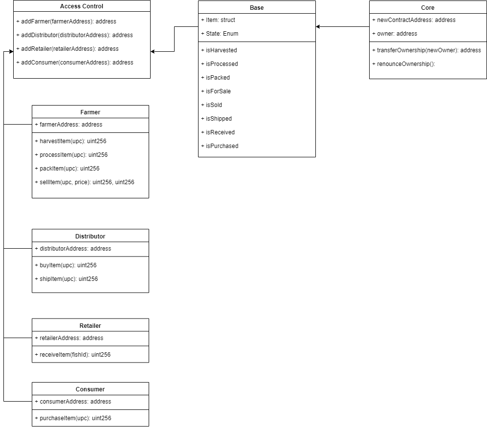

# Blockchain Supply Chain Solution

This is a project for Udacity's Nanodegree [Blockchain Developer](https://www.udacity.com/course/blockchain-developer-nanodegree--nd1309)

One of the biggest challenges with supply chains is the lack of transparency in product tracking which leads to increased costs, counterfeit goods, and unnecessary waste. From the food on our table to the luxury handbags on store shelves - how can we trust the products we buy? For this project, I built a DApp (Decentralized Application) authenticity management system backed by the Ethereum platform that help track product origination and verify product authenticity. 

## UML diagrams

Activity Diagram


Sequence Diagram


State Diagram


Data Model Diagram


NOTE: This model is for practice purpose. As a result, the model does not fully represent the supply chain in real life. E.g. Distributor ship coffee to Retailer without receiving payment. 

## Address on Rinkeby

Transaction ID
0xd024f91fd7fdf63f81c698c8dd993932101b016342ad481c47a13a6e581a87dc

Contract address
https://rinkeby.etherscan.io/address/0x5efcfc952f065200aba0dc7b6f8cc8ce4e38a8b5

## Steps

For local environment
1. Launch [Ganache](https://truffleframework.com/ganache) GUI
2. Run the following command to test smart contracts
	```
	truffle compile
	truffle migrate --reset
	truffle test
	```
3. Run local server with the following command:
	```
	npm run dev
	```
4. Test DApp in browser[http://localhost:3000/](http://localhost:3000/)

For Rinkeby network
1. Create a `.env` file in the root directory. Add environment-specific variables on new lines in the form of NAME=VALUE
	```
	WALLET_MNEMONIC='Your Mnemonic goes here'
	WEB3_PROVIDER='Your Infura Endpoint goes here'
	```
2. Run the following command to test smart contracts
	```
	truffle compile
	truffle migrate --reset --network rinkeby
	truffle test
	```
3. Run local server with the following command:
	```
	npm run dev
	```
4. Test DApp in browser[http://localhost:3000/](http://localhost:3000/)

Notes: In order to test this DApp in browser, you need MetaMask installed

